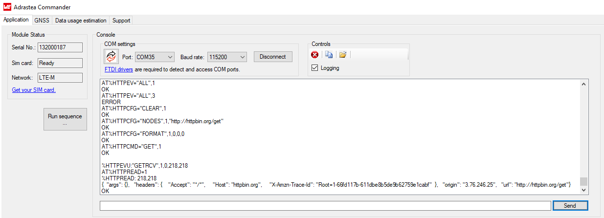

# HTTP Protocol with Adrastea-I

## Introduction
The Adrastea-I module supports HTTP over TCP and can be used for lightweight interactions such as sending and receiving data from web servers.

### Key Features
- **Protocol**: HTTP
- **Transport**: TCP
- **Security**: No security (for this setup)
- **HTTP Server**: httpbin.org

## Setup Instructions
The following commands guide the process of configuring HTTP communication. Each command is expected with an “OK” response

### 1. Clearing Previous HTTP Configurations
Before configuring a new HTTP session, clear any existing configurations:

```bash
AT%HTTPCFG="CLEAR",1
```

### 2. Enabling HTTP Event Notification
The following command enables HTTP event notifications from the Adrastea-I module:

```bash
AT%HTTPEV="ALL",1
```

### 3. Configuring the HTTP Node
Configure the HTTP node to connect to the target server, in this case, httpbin.org:

```bash
AT%HTTPCFG="NODES",1,"http://httpbin.org/get"
```

### 4. Setting HTTP Request Format
Set the format for the HTTP request to ensure proper communication. The parameters include method type, content type, and format:

```bash
AT%HTTPCFG="FORMAT",1,0,0,0

```

### 5. Sending an HTTP GET Request
To send an HTTP GET request to the server, use the following command:

```bash
AT%HTTPCMD="GET",1
```

Expected Output:
```bash
%HTTPEVU:"GETRCV",1,0,218,218
```

### 6. Reading the HTTP Response
Once the data is received, you can read the content of the HTTP response using the following command:

```bash
AT%HTTPREAD=1
```
After this, the message (e.g., "Hello world") needs to be entered as the next input:

Expected Output:
```bash
%HTTPREAD: 218,218

{
  "args": {},
  "headers": {
    "Accept": "*/*",
    "Host": "httpbin.org",
    "X-Amzn-Trace-Id": "Root=1-66fd117b-611dbe8b5de9b62759e1cabf"
  },
  "origin": "3.76.246.25",
  "url": "http://httpbin.org/get"
}
```

## Testing the MQTT Setup
To verify the setup:
1. Configure the Adrastea-I module using the commands listed above on Adrastea Commander.
2. Observe the HTTP response using the AT%HTTPREAD command, where the data returned from the server should contain request information.


*Fig.1 On Adrastea Commander, the GET command fetches the data from the website provided*