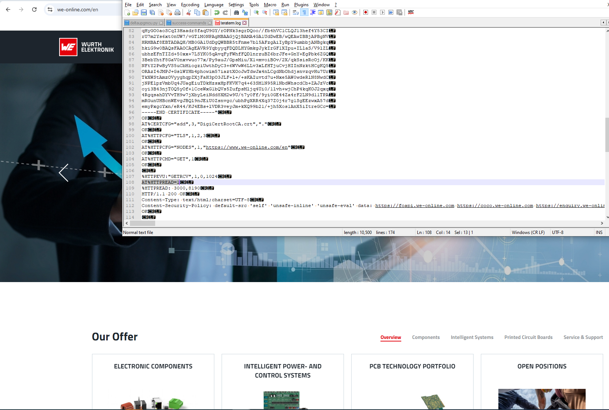

# HTTP Protocol with Adrastea-I

## Introduction
The Adrastea-I module supports HTTP over TCP and can be used for lightweight interactions such as sending and receiving data from web servers.

### Key Features
- **Protocol**: HTTPS
- **Transport**: TCP
- **Security**: TLS
- **HTTPS Server**: httpbin.org

## Setup Instructions
The following commands guide the process of configuring HTTP communication. Each command is expected with an “OK” response

### 1. Enabling HTTP Event Notification
The following command enables HTTP event notifications from the Adrastea-I module:

```bash
AT%HTTPEV="ALL",1
```

### 2. Clearing Previous HTTP Configurations
Before configuring a new HTTP session, clear any existing configurations:

```bash
AT%HTTPCFG="CLEAR",1
```

### 3. Adding the Digital Certificate of the website
Before accessing the website, make sure to search for the digital certificate of the website. In our WE website, the DigiCert Root CA certificate is used.
```bash
AT%CERTCMD="WRITE","DigiCertRootCA.crt",0,"-----BEGIN CERTIFICATE-----
MIIFazCCA1OgAwIBAgIRAIIQz7DSQONZRGPgu2OCiwAwDQYJKoZIhvcNAQELBQAw
TzELMAkGA1UEBhMCVVMxKTAnBgNVBAoTIEludGVybmV0IFNlY3VyaXR5IFJlc2Vh
cmNoIEdyb3VwMRUwEwYDVQQDEwxJU1JHIFJvb3QgWDEwHhcNMTUwNjA0MTEwNDM4
WhcNMzUwNjA0MTEwNDM4WjBPMQswCQYDVQQGEwJVUzEpMCcGA1UEChMgSW50ZXJu
ZXQgU2VjdXJpdHkgUmVzZWFyY2ggR3JvdXAxFTATBgNVBAMTDElTUkcgUm9vdCBY
MTCCAiIwDQYJKoZIhvcNAQEBBQADggIPADCCAgoCggIBAK3oJHP0FDfzm54rVygc
h77ct984kIxuPOZXoHj3dcKi/vVqbvYATyjb3miGbESTtrFj/RQSa78f0uoxmyF+
0TM8ukj13Xnfs7j/EvEhmkvBioZxaUpmZmyPfjxwv60pIgbz5MDmgK7iS4+3mX6U
A5/TR5d8mUgjU+g4rk8Kb4Mu0UlXjIB0ttov0DiNewNwIRt18jA8+o+u3dpjq+sW
T8KOEUt+zwvo/7V3LvSye0rgTBIlDHCNAymg4VMk7BPZ7hm/ELNKjD+Jo2FR3qyH
B5T0Y3HsLuJvW5iB4YlcNHlsdu87kGJ55tukmi8mxdAQ4Q7e2RCOFvu396j3x+UC
B5iPNgiV5+I3lg02dZ77DnKxHZu8A/lJBdiB3QW0KtZB6awBdpUKD9jf1b0SHzUv
KBds0pjBqAlkd25HN7rOrFleaJ1/ctaJxQZBKT5ZPt0m9STJEadao0xAH0ahmbWn
OlFuhjuefXKnEgV4We0+UXgVCwOPjdAvBbI+e0ocS3MFEvzG6uBQE3xDk3SzynTn
jh8BCNAw1FtxNrQHusEwMFxIt4I7mKZ9YIqioymCzLq9gwQbooMDQaHWBfEbwrbw
qHyGO0aoSCqI3Haadr8faqU9GY/rOPNk3sgrDQoo//fb4hVC1CLQJ13hef4Y53CI
rU7m2Ys6xt0nUW7/vGT1M0NPAgMBAAGjQjBAMA4GA1UdDwEB/wQEAwIBBjAPBgNV
HRMBAf8EBTADAQH/MB0GA1UdDgQWBBR5tFnme7bl5AFzgAiIyBpY9umbbjANBgkq
hkiG9w0BAQsFAAOCAgEAVR9YqbyyqFDQDLHYGmkgJykIrGF1XIpu+ILlaS/V9lZL
ubhzEFnTIZd+50xx+7LSYK05qAvqFyFWhfFQDlnrzuBZ6brJFe+GnY+EgPbk6ZGQ
3BebYhtF8GaV0nxvwuo77x/Py9auJ/GpsMiu/X1+mvoiBOv/2X/qkSsisRcOj/KK
NFtY2PwByVS5uCbMiogziUwthDyC3+6WVwW6LLv3xLfHTjuCvjHIInNzktHCgKQ5
ORAzI4JMPJ+GslWYHb4phowim57iaztXOoJwTdwJx4nLCgdNbOhdjsnvzqvHu7Ur
TkXWStAmzOVyyghqpZXjFaH3pO3JLF+l+/+sKAIuvtd7u+Nxe5AW0wdeRlN8NwdC
jNPElpzVmbUq4JUagEiuTDkHzsxHpFKVK7q4+63SM1N95R1NbdWhscdCb+ZAJzVc
oyi3B43njTOQ5yOf+1CceWxG1bQVs5ZufpsMljq4Ui0/1lvh+wjChP4kqKOJ2qxq
4RgqsahDYVvTH9w7jXbyLeiNdd8XM2w9U/t7y0Ff/9yi0GE44Za4rF2LN9d11TPA
mRGunUHBcnWEvgJBQl9nJEiU0Zsnvgc/ubhPgXRR4Xq37Z0j4r7g1SgEEzwxA57d
emyPxgcYxn/eR44/KJ4EBs+lVDR3veyJm+kXQ99b21/+jh5Xos1AnX5iItreGCc=
-----END CERTIFICATE-----"

```

### 4. Add the TLS layer
Configure a new TLS session:

```bash
AT%HTTPCFG="TLS",1,2,3
```

### 5. Configuring the HTTP Node
Configure the HTTP node to connect to the target server, in this case, [WE-online](https://www.we-online.com/en):

```bash
AT%HTTPCFG="NODES",1,"https://www.we-online.com/en"
```

### 6. Sending an HTTP GET Request
To send an HTTP GET request to the server, use the following command:

```bash
AT%HTTPCMD="GET",1
```

Expected Output:
```bash
OK

%HTTPEVU:"GETRCV",1,0,1024
```

### 6. Reading the HTTP Response
Once the data is received, you can read the content of the HTTP response using the following command:

```bash
AT%HTTPREAD=1
```
After this, the text on the website would be received
Expected Output:
```bash
%HTTPREAD: 3000,8190
HTTP/1.1 200 OK
Content-Type: text/html;charset=UTF-8
Content-Security-Policy: default-src 'self' 'unsafe-inline' 'unsafe-eval' data: https://foapi.we-online.com https://coco.we-online.com https://enquiry.we-online.com https://www.googletagmanager.com https://html5-player.libsyn.com; font-src 'self' data: https://netdna.bootstrapcdn.com https://userlike-cdn-umm.b-cdn.net https://*.cloudfront.net; frame-ancestors https://redexpert.we-online.com/ https://cmsprod.we-group.com; script-src 'self' 'unsafe-inline' 'unsafe-eval' https://locationexplorer.de https://snap.licdn.com/li.lms-analytics/insight.min.js https://hit.uptrendsdata.com https://redexpert.we-online.de https://userlike-cdn-umm.b-cdn.net https://*.cloudfront.net https://userlike-cdn-widgets.s3-eu-west-1.amazonaws.com https://redexpert.we-online.com https://coco.we-online.com https://www.youtube.com/s/player/ https://www.youtube.com/iframe_api https://connect.facebook.net https://www.google-analytics.com https://www.googletagmanager.com https://s.go-mpulse.net https://*.lfeeder.com; frame-src https://locationexplorer.de https://www.iqdfrequencyproducts.com https://redexpert.we-online.com https://careers.flatchr.io https://enquiry.we-online.com https://mit.we-online.com https://www.youtube.com https://www.facebook.com https://coco.we-online.com https://html5-player.libsyn.com https://*.go-mpulse.net; connect-src 'self' https://pagead2.googlesyndication.com https://*.akamaihd.net https://trial-eum-clientnsv4-s.akamaihd.net https://trial-eum-clienttons-s.akamaihd.net https://cdn.linkedin.oribi.io/partner/208516/domain/we-online.com/token https://hit.uptrendsdata.com https://region1.analytics.google.com https://userlike-cdn-umm.b-cdn.net https://www.facebook.com https://*.cloudfront.net wss://umd.userlike.com https://www.userlike.com https://api.userlike.com https://userlike-cdn-widgets.s3-eu-west-1.amazonaws.com https://stats.g.doubleclick.net https://redexpert.we-online.de/api/geoIp/ https://region1.google-analytics.com/ https://foapi.we-online.com https://coco.we-online.com https://api.we-online.com/svc/geoIp/ https://api.friendlycaptcha.com https://www.google-analytics.com https://s.go-mpulse.net https://c.go-mpulse.net https://px.ads.linkedin.com https://*.akstat.io blob: ; img-src 'self' data: base64 https://px.ads.linkedin.com https://www.google.de https://userlike-cdn-operators.userlike.com https://www.digikey.se https://www.digikey.de https://www.digikey.com https://region1.google-analytics.com https://redexpert.we-online.de https://redexpert.we-online.com https://www.powerelement.com https://userlike-store-media-files.s3.amazonaws.com https://userlike-cdn-operators.s3-eu-west-1.amazonaws.com https://i.ytimg.com https://we-online.com https://www.we-online.com https://coco.we-online.com https://www.kununu.com https://www.facebook.com https://www.instagram.com https://www.tiktok.com https://www.xing.com https://www.linkedin.com https://www.google-analytics.com https://www.googletagman
OK
```

## Testing the MQTT Setup
To verify the setup:
1. Configure the Adrastea-I module using the commands listed above on Adrastea Commander.
2. Observe the HTTPS response using the AT%HTTPREAD command, where the data returned from the server should contain request information.


*Fig.1 The data from the website is visible in plaintext*