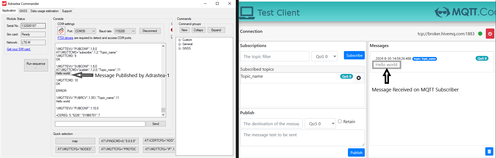

# MQTT Protocol with Adrastea-I

## Introduction
The Adrastea-I module supports the MQTT protocol for lightweight messaging between devices. MQTT is ideal for scenarios where bandwidth is limited or connectivity is intermittent.

### Key Features
- **Protocol**: MQTT
- **Transport**: TCP
- **Security**: No security (for this setup)
- **Broker**: [HiveMQ Public Broker](http://www.hivemq.com)

## Setup Instructions
The following commands guide the process of configuring MQTT communication without security certificates. Each command is expected with an “OK” response
### 1. Enabling MQTT Event Notification
To receive MQTT event notifications from the Adrastea-I module, use the following command:

```bash
AT%MQTTEV="all",1
```

### 2. Configuring the MQTT Broker
Configure the MQTT client to use a specific broker and set a client name. In this example, we use the HiveMQ broker.

```bash
AT%MQTTCFG="nodes",1,"Client_name","broker.hivemq.com"
```

### 3. Setting MQTT Protocol and Keep-Alive Interval
Configure the MQTT protocol and connection parameters. The command below sets the protocol version (0 for MQTT 3.1.1), a keep-alive interval of 1200 seconds, and enables clean sessions.

```bash
AT%MQTTCFG="PROTOCOL",1,0,1200,1
```

### 4. Establishing Connection to MQTT Broker

```bash
AT%MQTTCMD="connect",1
```

Expected Output:
```bash
%MQTTEVU:"CONCONF",1,0
```

‘0’ at the end signifies that the connection with server has been established, 1 signifies it is not connected.

### 5. Subscribing to a Topic
Use the following command to subscribe to the desired topic “Topic_name”.

```bash
AT%MQTTCMD="subscribe",1,2,"Topic_name"
```

Expected Output:
```bash
%MQTTCMD: 1
OK

%MQTTEVU:"SUBCONF",1,1,0
```

### 6. Publishing a Message to a Topic
To publish a message to a subscribed topic, use the publish command. The length of the message must be specified before publishing (In the following case, length is 11).

```bash
AT%MQTTCMD="publish",1,2,0,"Topic_name",11
```
After this, the message (e.g., "Hello world") needs to be entered as the next input:

Expected Output:
```bash
%MQTTCMD: 2
OK
%MQTTEVU:"PUBRCV",1,101,"Topic_name",11
Hello world
%MQTTEVU:"PUBCONF",1,2,0
```

## Testing the MQTT Setup
To verify the setup, you can use the MQTT Cool platform (or similar) for testing:
1. Open the MQTT Cool test client: MQTT Cool.
2. Set the broker to tcp://broker.hivemq.com:1883.
3. Subscribe to the Topic_name topic with QoS0.
4. Publish the message using the publish AT command (as shown in step 6), and you should see the message "Hello world" appear on the MQTT Cool platform.



*Fig.1 Left window: Adrastea Commander with AT Commands. Right window: MQTT test site with output of the published messages from Adrastea-1*