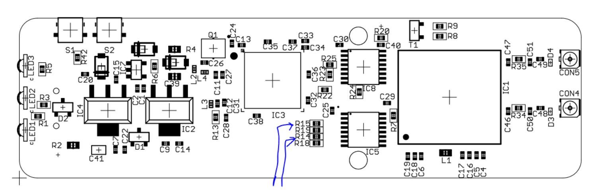
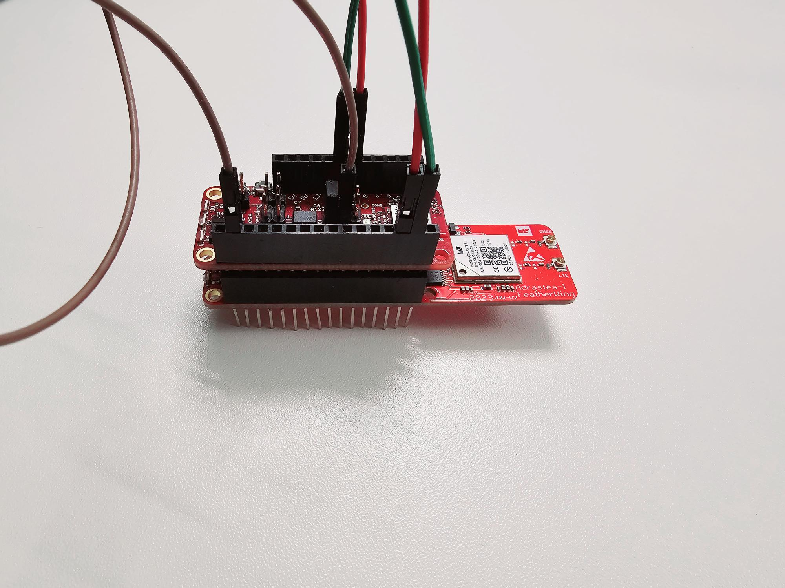
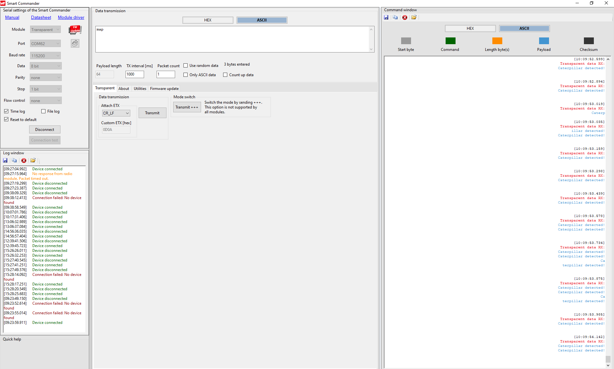
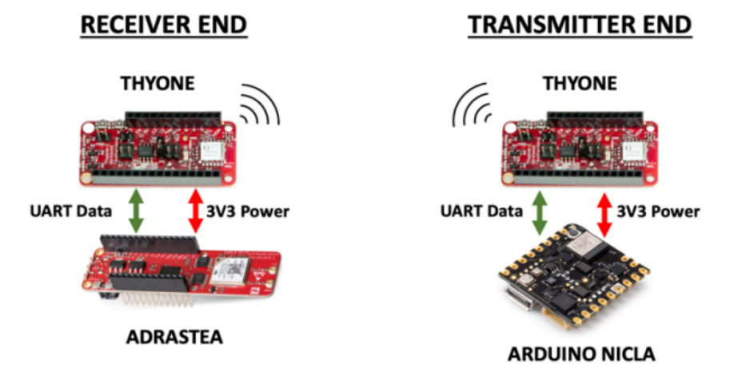

# Establishing External UART Connectivity with Adrastea FeatherWings and Data Transmission via MQTT

## Introduction
This document explains how to connect an external UART to Adrastea FeatherWings and how to view the transmitted data over MQTT. Adrastea FeatherWings lacks a direct jumper connection between the FTDI and UART pins, necessitating some modifications to create an external UART connection.

### Modifying Adrastea FeatherWing:
To enable the external UART connection, the internal UART pins need to be isolated. This is achieved by removing the R14 and R15 resistors located on the UART0 line of the Adrastea FeatherWing (marked below).

## Steps to Demonstrate External UART using Thyone FeatherWing:
1. Stack the Thyone FeatherWing on top of the Adrastea FeatherWings.
2. Configure the Thyone module to operate in transparent mode by connecting the 4th pin
of JP1 to the 3V3 power source.
3. Thyone transmits data from UART1, whereas Adrastea uses UART0. Therefore,
connect:
U1Tx to U0Rx & U1Rx to U0Tx

4. Use the Thyone USB stick with the SmartCommander tool to visualize, control, and transmit
data. Program the transmitter to send data in transparent mode, transmitting the data to the
Thyone receiver.

## Pest Detection with Arduino Nicla
For the pest detection project, use the repository in https://github.com/rmitry/pest-detection to
program the Nicla Vision.
Download the Adrastea project from GitHub and flash the binary file (Sensor_Demo.bin) at:
https://github.com/svh-eiSmart/adrastea_mouser/tree/master/examples/ALT125X/SensorDemo/Eclipse
As seen in the figure below, on the transmitter side, the Arduino Nicla Vision Module interfaces
with the Thyone radio module. Upon the detection of a caterpillar, the Arduino Nicla initiates the
transmission of the string "Caterpillar detected" to the Thyone module through UART. The
Thyone radio module, operating in transparent mode, then transmits this data to the receiver
system. The receiver system incorporates a separate Thyone module connected to an Adrastea
module via UART (externally connected UART to Adrastea). The received data is processed by
Adrastea and forwarded over external UART to the Adrastea module, which subsequently sends
the information to the cloud via MQTT. This data is visualized through an MQTT client
application, providing a comprehensive overview of the caterpillar detection system's data
transmission process.

Visualize the data at:
https://testclient-cloud.mqtt.cool/
Broker: tcp://broker.hivemq.com:1883
Topic: Adra
Every time a caterpillar is detected, the warning message “Caterpillar Detected!” is then
detected after subscribing on the respective broker and topic.

## Programming the Nicla Vision
Install OpenMV Studio. Just connect the Nicla Vision and load the firmware from the link
attached in the beginning, and connect and run from OpenMV
